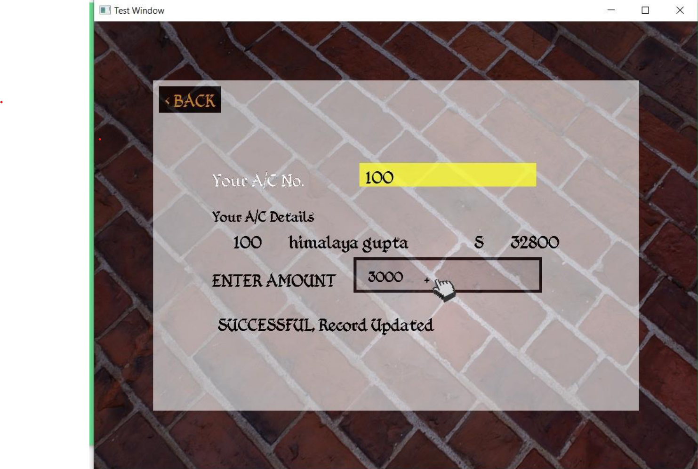

# Bank Management System(BMS)

The Bank Management System(BMS) application made with C++, OpenGL with Custom Interactive GUI Implementation.

My old OpenGL Project (where i did UI From scratch)  
> Note: if you try typing "focus", "ride", "light" (in main menu, like you do cheats for GTA game) few weird thigs will happen (like ester eggs)  
> somehow "light" dosen't work in release mod (and i have no intention to fix that)

## Main-menu

## ACCOUNT CREATION/DELETION
Simple creation of a new account and deletion of an existing account
is one of the basic features of BMS. Types of account possible in this
BMS :
• Saving account
• Current account

## DEPOSIT/WITHDRAWL
This can be done through customer section. A user can deposit
and withdraw money from it.

## LOG FILE
Every activity carried out in the BMS will be stored in a single log file.
Each transaction ,each deposit or withdrawal, etc will have its entry
marked in this log file with time and date of the transaction.
## ACCOUNT HOLDER LIST

## ACCOUNT DETAIL and Modifications
This section contains the detail of account holder
such as acc. no. ,name , a/c type , balance.

Want to convert your account from saving to current or vice versa ??
No problem , with our modify account functionality , user can
modify his/her account

[Project Report pdf link for viewing](https://drive.google.com/viewerng/viewer?embedded=true&url=https://raw.githubusercontent.com/lalishansh/BankManagementSystem-with-C-and-OpenGL/main/ProjectReportDs.pdf)

